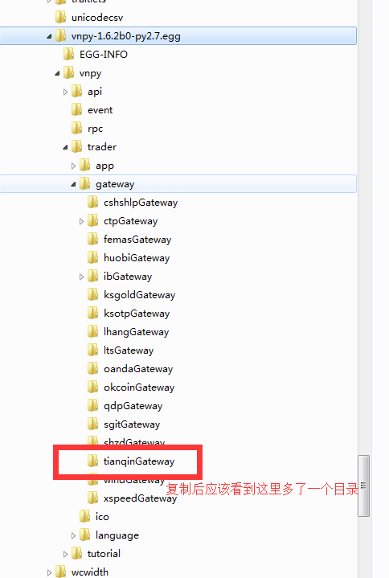

# vnpy-tianqin - vn.py到天勤行情的接口


---
### 简介

* vn.py是一套基于Python的开源量化交易程序开发框架(https://github.com/vnpy/vnpy)
* 天勤行情是一款免费行情软件，可以提供报价及历史行情序列及历史数据复盘等特性。(http://www.tq18.cn)
* 本项目为vn.py项目提供一个扩展，使得vn.py框架可以连接到本地运行的天勤行情软件进程，以获取报价及历史行情数据，并利用其历史数据复盘功能进行策略测试等。


---
### 环境准备

1. 支持的操作系统：Windows 7/8/10/Server 2008
2. 安装[vn.py](https://github.com/vnpy/vnpy) 及其依赖项
3. 安装[天勤行情软件](http://www.tq18.cn)

---
### 安装

**安装必要的依赖库**

```
pip install tornado
```

**安装本扩展包**

在[这里](https://github.com/tianqin18/vnpy-tianqin/releases)下载最新版本，解压后，将所有文件复制到 vn.py 安装目录。
复制完成以后的目录应该是这个样子：




---
### Quick Start

1. 启动天勤行情软件，并进入主界面，确保有行情数据显示（选择实时行情或历史行情复盘均可）

2. 在任意目录将以下内容保存为demo.py，并运行，即可看到屏幕上有行情数据持续刷新

```
# encoding: UTF-8

# 重载sys模块，设置默认字符串编码方式为utf8
import sys
reload(sys)
sys.setdefaultencoding('utf8')

from vnpy.event import EventEngine
from vnpy.trader.gateway.tianqinGateway.tianqinGateway import TianQinGateway
from vnpy.trader.uiQt import qApp


class DemoApp(object):
    # ----------------------------------------------------------------------
    def __init__(self):
        """Constructor"""
        self.eventEngine = EventEngine()
        self.eventEngine.start()
        self.tianqinGateway = TianQinGateway(self.eventEngine)

    def start(self):
        self.tianqinGateway.connect()
        self.tianqinGateway.subscribe_quote(["cu1803", "SR801", "c1801", "IF1708"], self.on_quote_data)
        self.tianqinGateway.subscribe_chart("cu1803", 5, 1000, self.on_chart_data)
        self.tianqinGateway.subscribe_chart("au1712", 0, 1000, self.on_chart_data)

    def on_quote_data(self, ins_id):
        quote = self.tianqinGateway.get_quote(ins_id)
        print("quote_update", ins_id, quote)

    def on_chart_data(self, ins_id, dur_seconds):
        if dur_seconds == 0:
            tick_serial = self.tianqinGateway.get_tick_serial(ins_id)
            print("tick_serial_update", tick_serial)
        else:
            kline_serial = self.tianqinGateway.get_kline_serial(ins_id, dur_seconds)
            print("kline_serial_update", kline_serial)

#----------------------------------------------------------------------
if __name__ == '__main__':
    app = DemoApp()
    app.start()
    sys.exit(qApp.exec_())
```

---
### 联系作者

* email：tianqincn@gmail.com
* QQ: 166210483


